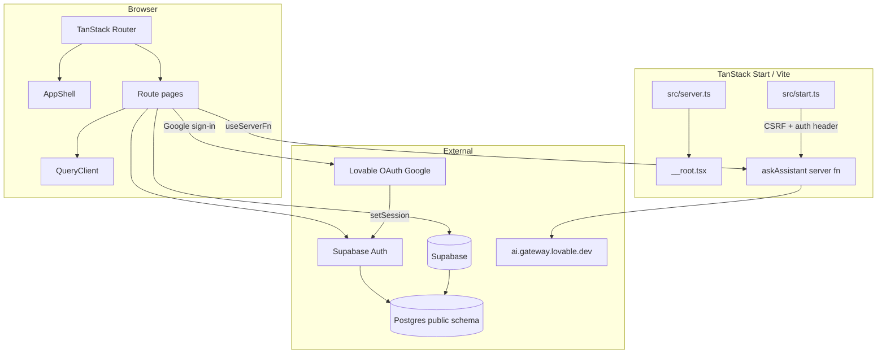

# Architecture

Searching Eyes is a **full-stack React app** (TanStack Start on Vite) talking to **Supabase** for auth and data, plus the **Lovable AI gateway** for the campus assistant.

## Stack

| Layer | Choice | Where |
| --- | --- | --- |
| UI | React 19, Tailwind 4, shadcn/ui (Radix) | `src/routes`, `src/components` |
| Routing | TanStack Router file routes | `src/routes`, `src/routeTree.gen.ts` |
| Data fetching | TanStack Query | `src/lib/queries.ts`, route components |
| SSR / server fns | TanStack Start + Nitro | `src/start.ts`, `src/server.ts`, `src/lib/ai.functions.ts` |
| Auth + DB | Supabase Auth + Postgres + RLS | `src/integrations/supabase`, `supabase/migrations` |
| OAuth helper | Lovable Cloud Auth (Google) | `src/integrations/lovable` |
| Types | Generated `Database` types | `src/integrations/supabase/types.ts` |

Package manager is **Bun** (`bun.lock`, `bunfig.toml`). Vite config is wrapped by `@lovable.dev/vite-tanstack-config` — extra Vite plugins must not be duplicated in `vite.config.ts`.

## Runtime diagram



## Request path

1. **Document / SSR** — `src/server.ts` wraps TanStack Start’s server entry. JSON 500s swallowed by h3 are rewritten to an HTML error page.
2. **Client navigation** — file routes under `src/routes`. Layout `/_authenticated` runs `beforeLoad`, requires a session and a campus email, then wraps children in `AppShell`.
3. **Data** — pages call `useQuery(...)` with shared `queryOptions` from `src/lib/queries.ts`. The browser Supabase client uses the **publishable** key; **RLS** is the real security boundary.
4. **Mutations** — pages call `supabase.from(...).insert/update/delete` and invalidate matching query keys.
5. **AI** — `askAssistant` is a POST server function. CSRF middleware applies to server functions. The client attaches `Authorization: Bearer <access_token>` via `attachSupabaseAuth`.

## Layout of the repo

```
.
├── src/
│   ├── routes/              # Pages and layouts (file-based)
│   ├── components/          # AppShell + shadcn/ui primitives
│   ├── hooks/               # useSession, use-mobile
│   ├── lib/                 # queries, campus email, AI, formatters
│   ├── integrations/        # Supabase + Lovable auth
│   ├── assets/              # Default event cover images
│   ├── router.tsx           # createRouter + QueryClient
│   ├── start.ts             # Start middleware (CSRF, errors, auth header)
│   └── server.ts            # HTTP fetch wrapper / SSR errors
├── supabase/
│   ├── config.toml          # project_id
│   └── migrations/          # Schema, RLS, RPCs, seed
├── wiki/                    # This documentation
├── public/                  # robots.txt, static assets
└── vite.config.ts
```

## Design principles in this codebase

- **Campus-only accounts.** `isCampusEmail` allows `mdu.edu.in` (and subdomains) plus `searchingeyes.test` for QA.
- **Authorization in the database.** `is_admin` / `has_role` are `SECURITY DEFINER` SQL helpers used by RLS policies.
- **Admins vs students.** `useMe()` treats `club_admin` or `super_admin` as admin. The `/admin` UI still checks `isAdmin` and hides the Team tab unless `super_admin`.
- **SSR off for authenticated routes.** `/_authenticated` and `/auth` set `ssr: false` so session checks run in the browser.
