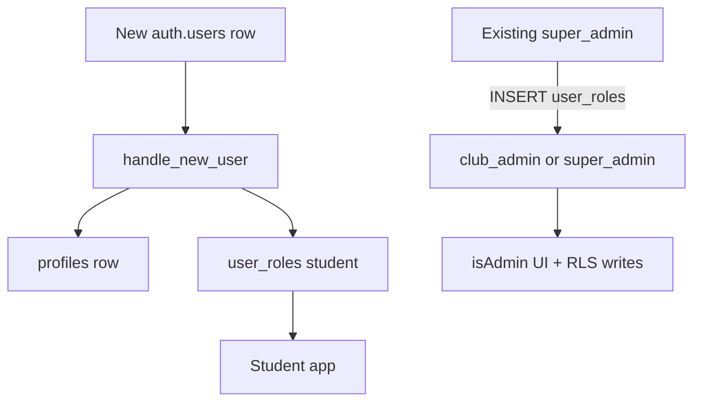

# Auth and roles

## Who can have an account

`src/lib/campus.ts`:

- Production campus domain: **`mdu.edu.in`** (exact or subdomain)
- QA: **`searchingeyes.test`**
- Copy shown to users only mentions `@mdu.edu.in`

Checks happen:

1. Before email/password submit
2. After Google OAuth session is set
3. On every `_authenticated` `beforeLoad`

Failed campus checks **sign the user out**.

## Sign-in methods

| Method | Implementation |
| --- | --- |
| Email + password | `supabase.auth.signInWithPassword` / `signUp` |
| Google | `lovable.auth.signInWithOAuth("google")` then `supabase.auth.setSession` |

Sign-up options include `emailRedirectTo: window.location.origin` and metadata `{ full_name }`. If email confirmation is on, `data.session` is null and the UI shows a resend control (`auth.resend` type `signup`).

## Session in the browser

`src/integrations/supabase/client.ts`:

- URL/key from `VITE_SUPABASE_URL` / `VITE_SUPABASE_PUBLISHABLE_KEY` (or `SUPABASE_URL` / `SUPABASE_PUBLISHABLE_KEY` on the server)
- `persistSession` + `autoRefreshToken`
- Preview-safe storage via `brokeredPreviewStorage()`
- Custom `fetch` so new-style `sb_publishable_` keys are sent as `apikey` without a bogus Bearer duplicate

`useUser` listens to `onAuthStateChange`. Root route invalidates router + queries on sign-in/out.

## Server functions and JWT

`attachSupabaseAuth` (function middleware, **client** side) copies `session.access_token` into `Authorization` for server functions.

`requireSupabaseAuth` (available, not wired globally) validates Bearer JWT with `getClaims` and injects `{ supabase, userId, claims }`. CSRF middleware in `src/start.ts` only applies when `handlerType === "serverFn"`.

The campus assistant currently does **not** call `requireSupabaseAuth`; the page is already behind the authenticated layout.

## Role model

| Capability | student | club_admin | super_admin |
| --- | --- | --- | --- |
| Read events, feed, announcements, activities | yes | yes | yes |
| RSVP, post, like, comment, report, edit own profile | yes | yes | yes |
| Create/delete events, publish announcements, write activities | RLS no | yes | yes |
| Insert notifications for others | no | yes | yes |
| Resolve reports / set `posts.removed` | no | yes | yes |
| Call `admin_stats` (returns row) | empty | yes | yes |
| Grant/revoke roles (RLS) | no | no | yes |
| See Admin nav and `/admin` tabs | no | yes | yes |
| See Admin **team** tab | no | no | yes (filtered in UI) |

`suspended` on `profiles` is stored but not checked in the React gate as of this documentation.

## Test super admin

Migration grants `super_admin` to `auth.users` where `email = 'admin@searchingeyes.test'`. That domain is allowed by `isCampusEmail`.
