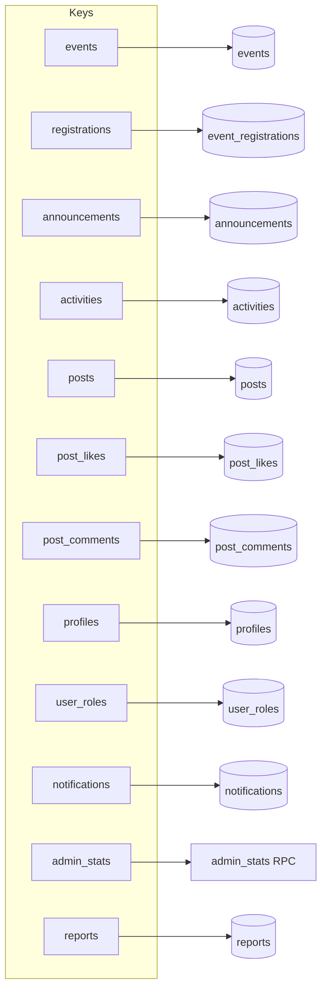
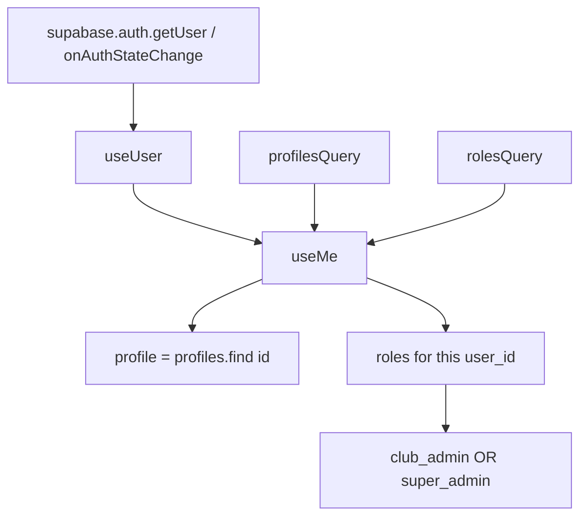
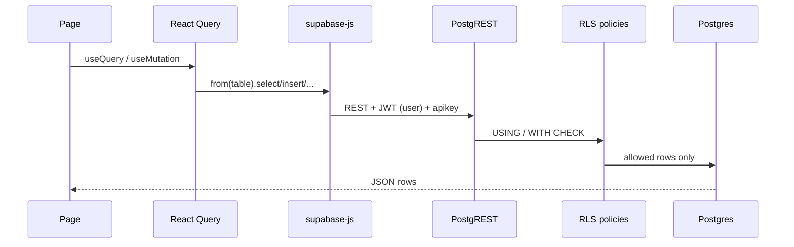

# Data flows

All list/detail reads go through **TanStack Query** option factories in `src/lib/queries.ts`. The helper `unwrap` throws if PostgREST returns an error.

## Query catalog

| Query key | Table / RPC | Order / limit |
| --- | --- | --- |
| `events` | `events` | `event_date` ascending |
| `registrations` | `event_registrations` | `id, event_id, user_id` |
| `announcements` | `announcements` | `published_at` descending |
| `activities` | `activities` | `activity_date` descending |
| `posts` | `posts` | `created_at` desc, limit 60 |
| `post_likes` | `post_likes` | `post_id, user_id` |
| `post_comments` | `post_comments` | `created_at` ascending |
| `profiles` | `profiles` | all members (RLS: authenticated SELECT) |
| `user_roles` | `user_roles` | `user_id, role` |
| `notifications` | `notifications` | `created_at` desc (RLS: own rows only) |
| `admin_stats` | `admin_stats()` | first row or null if not admin |
| `reports` | `reports` | `created_at` desc (RLS: reporter or admin) |

## Session derivation

`useMe` also exposes the full `profiles` list so the community feed and admin screens can resolve display names without extra joins.

## Write → cache

| Mutation | Invalidates |
| --- | --- |
| Register / leave event | `registrations` |
| Create / delete post | `posts` |
| Like / unlike | `post_likes` |
| Add comment | `post_comments` |
| Report post | (toast only; reports list is admin-side) |
| Mark notifications read | `notifications` |
| Update profile | `profiles` |
| Admin create/delete event | typically local queries on events |
| Admin publish announcement | announcements query on that screen |
| Moderation resolve | `reports` and `posts` |

Global auth changes (`SIGNED_IN`, `USER_UPDATED`) call `queryClient.invalidateQueries()` from `__root.tsx`.

## Client → Postgres path

There is **no custom REST API** in this repo for domain data. The AI assistant is the main custom server function.

## Assistant data path

The assistant does not query Postgres itself. `/assistant` already has `eventsQuery` and `announcementsQuery`. It serializes a short text brief into `context` (max 4000 chars in the Zod schema) so the model can answer about current campus data.

## Image data

Event covers: if `events.cover_image` is set, that URL is used; otherwise `coverFor(category)` maps to bundled assets in `src/assets` (`event-workshop.jpg`, `event-hackathon.jpg`, etc.).
