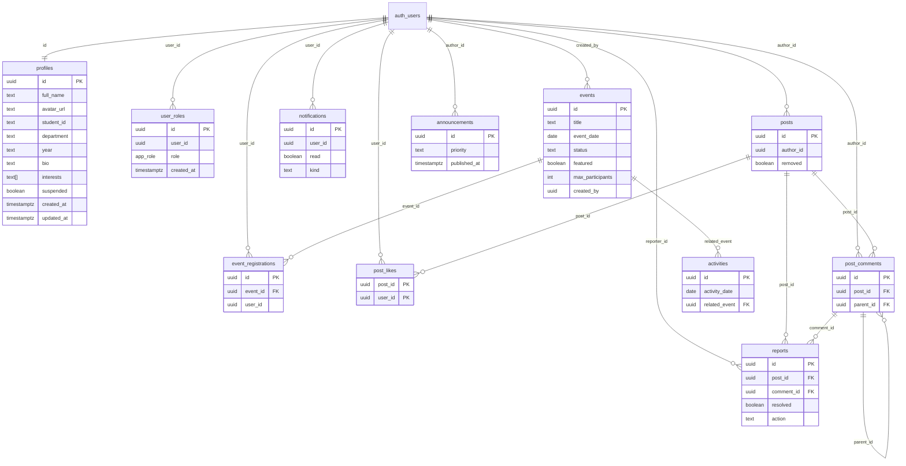

# Database

Postgres lives in Supabase project `pogwasqqwuykcxsvzwsv` (`supabase/config.toml`). Schema is owned by migrations under `supabase/migrations/`. TypeScript mirrors it in `src/integrations/supabase/types.ts`.

Auth users live in **`auth.users`** (Supabase-managed). Public tables reference those UUIDs.

## Entity-relationship diagram



`auth_users` is shown for relationships; it is not a `public` table you migrate in this repo.

## Enum: `app_role`

```sql
CREATE TYPE public.app_role AS ENUM ('student', 'club_admin', 'super_admin');
```

| Value | Meaning in the app |
| --- | --- |
| `student` | Default on signup (`handle_new_user`) |
| `club_admin` | `is_admin` true → events/announcements/activities write, admin UI, notifications insert |
| `super_admin` | Admin plus `has_role(..., 'super_admin')` for granting/revoking roles |

A user may hold **multiple** roles (`UNIQUE (user_id, role)`). `useMe().isAdmin` is true if either admin role is present.

## Table explainer

### `profiles`

1:1 with `auth.users` (`ON DELETE CASCADE`). Public member directory: name, avatar, student id, department, year, bio, interests, `suspended` flag.

- SELECT: any authenticated user
- INSERT/UPDATE: only `auth.uid() = id` (you cannot edit someone else’s profile via RLS)
- `updated_at` maintained by `touch_updated_at`

### `user_roles`

Role assignments. SELECT for all members (so the client can show Admin and badges). INSERT only if the actor is `super_admin`. DELETE only if actor is `super_admin` **and** `user_id <> auth.uid()` (you cannot strip your own role).

Seed: `admin@searchingeyes.test` is granted `super_admin` if that auth user exists.

### `events`

Club calendar. Categories used in the UI include `workshop`, `hackathon`, `drive`, `music`, `social`, plus archive categories on activities (`competition`, `project`, `general`). Default `status` is `registration_open`. `gallery` is `text[]`. Writes: `is_admin`.

### `event_registrations`

RSVP join table. Unique `(event_id, user_id)`. INSERT self only. DELETE self or admin. SELECT all members (counts and “who joined” for admin calendar).

### `announcements`

Campus notices. `priority` is a free `text` (app uses `normal`, `urgent`, `important` in seed). Admin write. SELECT all members.

### `activities`

Past work / archive. Optional `related_event` → `events`. Admin write. SELECT all members.

### `posts` / `post_likes` / `post_comments`

Feed. `posts.removed` hides content from typical SELECT (`removed = false` OR admin OR author). Likes are a composite PK. Comments may nest via `parent_id` (UI currently inserts top-level comments).

### `reports`

Moderation queue. May point at a post and/or comment. Extra columns from a later migration: `action`, `admin_note`, `resolved_by`, `resolved_at`. SELECT: admin or the reporter. INSERT: self as reporter. UPDATE: admin.

The community UI inserts `reason: "Reported by member"`. Admins set `action` to `approved` or `deleted` and toggle `posts.removed`.

### `notifications`

Per-user inbox. SELECT/UPDATE own rows. INSERT allowed for admins (`is_admin`). `kind` defaults to `general`.

## SQL functions

### `has_role(_user_id, _role)`

`SECURITY DEFINER`, stable. True if that user has the enum role.

### `is_admin(_user_id)`

True if `club_admin` or `super_admin`.

Used heavily in RLS (`USING (public.is_admin(auth.uid()))`).

### `handle_new_user()`

Trigger on `auth.users` INSERT:

1. Insert `profiles` with `full_name` from metadata or email local-part, plus `avatar_url`
2. Insert `user_roles (student)`
3. `ON CONFLICT DO NOTHING`

EXECUTE revoked from `PUBLIC` / `anon` / `authenticated` (trigger still runs as definer).

### `touch_updated_at()`

Sets `NEW.updated_at = now()` on `profiles` and `events`.

### `admin_stats()`

Returns one row of counts **only if** `is_admin(auth.uid())` (the `WHERE` clause). Otherwise the result set is empty and the client shows null stats.

| Column | Source |
| --- | --- |
| `members` | count `profiles` |
| `members_week` | profiles created in last 7 days |
| `registrations` / `_week` | `event_registrations` |
| `posts` / `_week` | posts with `removed = false` |
| `notifications` / `_week` | all notifications |
| `events` | count events |
| `open_reports` | reports with `resolved = false` |

## RLS summary matrix

| Table | SELECT | INSERT | UPDATE | DELETE |
| --- | --- | --- | --- | --- |
| profiles | authenticated | own id | own id | — |
| user_roles | authenticated | super_admin | — | super_admin, not self |
| events | authenticated | admin | admin | admin |
| event_registrations | authenticated | self | — | self or admin |
| announcements | authenticated | admin | admin | admin |
| activities | authenticated | admin | admin | admin |
| posts | not removed, or admin/author | own author_id | admin | author or admin |
| post_likes | authenticated | self | — | self |
| post_comments | authenticated | own author_id | — | author or admin |
| reports | admin or reporter | self reporter | admin | — |
| notifications | own user_id | admin | own user_id | granted but no dedicated policy for members besides select/update |

Anon has **no** table grants for these public tables (grants are to `authenticated` and `service_role`). The landing page does not load member data.

## Seed content (first migration)

Demo events (photography workshop, hackathon, blood drive, open mic, completed clean sprint), three announcements, three activities. Dates are relative to `CURRENT_DATE` at migration time.

## Migrations in order

1. **20260908065509** — types, tables, RLS, trigger, seed
2. **20260908065539** — revoke/grant on helpers
3. **20260908073107** — `admin_stats`
4. **20260908074048** — report resolution fields
5. **20260908074115** — more function privilege tightening
6. **20260909090538** — super_admin role policies + test super admin email
