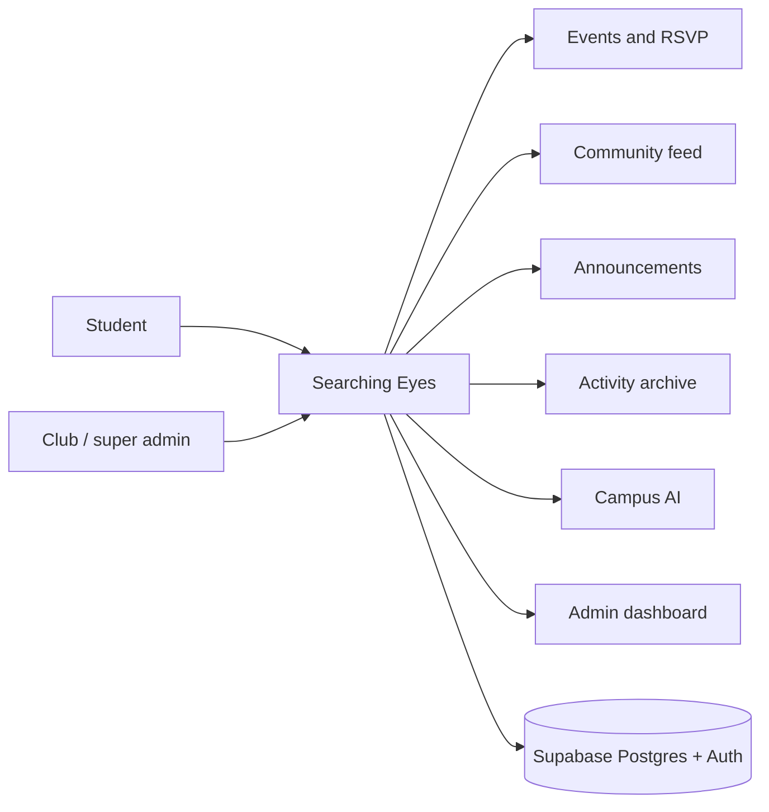

# Searching Eyes wiki

**Searching Eyes** is the campus community app for Maharshi Dayanand University (MDU). Students with official `@mdu.edu.in` email addresses sign in to discover events, read announcements, follow club activity, talk in a members-only feed, and ask an AI assistant. Club admins manage events, notices, and moderation.

Live app: [quick-app-switch.lovable.app](https://quick-app-switch.lovable.app)

This wiki documents the **entire codebase** in this repository: how the app is structured, how data moves, how screens connect, and how the Supabase database is designed.

## Start here

| Page | What it covers |
| --- | --- |
| [Architecture](Architecture.md) | Stack, runtime, folder map, high-level system diagram |
| [Source map](Source-Map.md) | Every application file and what it is for |
| [Routes and screens](Routes.md) | File-based routing, URLs, and UI shell |
| [User flows](User-Flows.md) | Sign-in, events, community, admin, assistant |
| [Data flows](Data-Flows.md) | React Query, writes, cache invalidation |
| [Database](Database.md) | Tables, keys, RLS, functions, seed data |
| [Auth and roles](Auth-and-Roles.md) | Campus email gate, OAuth, `student` / `club_admin` / `super_admin` |
| [Server and AI](Server-and-AI.md) | SSR entry, CSRF, campus assistant |
| [Development](Development.md) | Local setup, env vars, conventions |

## Product at a glance

Campus identity is enforced in the client (`src/lib/campus.ts`) and on every authenticated layout load. Persistence, authorization, and most business rules live in **Supabase** (Postgres + Row Level Security). The UI is a **TanStack Start** (Vite) React app styled with Tailwind and shadcn/ui.
