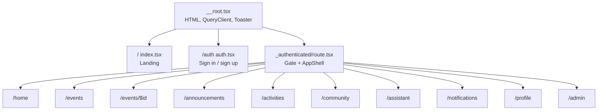

# Routes and screens

TanStack Start uses **file-based routing**. Every `.tsx` file under `src/routes` is a route. There is no `src/pages/` or Next.js `app/` tree. The only root layout is `__root.tsx`.

## Route tree

## Authenticated gate

`src/routes/_authenticated/route.tsx`:

1. `ssr: false`
2. `supabase.auth.getUser()`
3. Missing user → redirect `/auth`
4. Email not campus (`isCampusEmail`) → `signOut` then `/auth`
5. Otherwise render `AppShell` + `<Outlet />`

## Navigation chrome

`AppShell` (`src/components/AppShell.tsx`):

**Primary (sidebar + mobile bottom nav):** Home, Events, Community, Assistant, Profile.

**Sidebar extras (desktop):** Announcements, Activities, Notifications (unread count from `notificationsQuery`).

**Admin:** link to `/admin` only when `useMe().isAdmin`.

Mobile header shows notifications and profile; bottom nav is the five primary items.

## Screen → data

| Screen | Queries | Writes |
| --- | --- | --- |
| Home | events, announcements, activities, posts, registrations | — |
| Events list | events | — |
| Event detail | events, registrations | insert/delete `event_registrations` |
| Announcements | announcements | — |
| Activities | activities | — |
| Community | posts, likes, comments | posts, likes, comments, reports |
| Assistant | events, announcements | server fn `askAssistant` (no DB) |
| Notifications | notifications | `read = true` |
| Profile | events, registrations, posts, profiles | update `profiles`; `signOut` |
| Admin | admin_stats, events, posts, registrations, reports, profiles | events, announcements, posts.removed, reports, profiles |

## Root behaviors

- Auth `SIGNED_IN` / `SIGNED_OUT` / `USER_UPDATED` invalidates the router; non-sign-out also invalidates React Query.
- Custom 404 and error components; errors also call `reportLovableError`.
