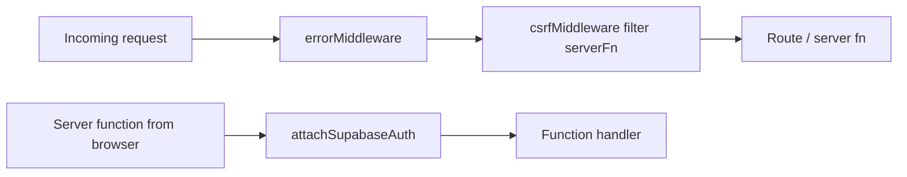

# Server and AI

## HTTP entry

`src/server.ts` is the Vite/Nitro server entry (`vite.config.ts` → `tanstackStart.server.entry = "server"`).

It:

1. Lazy-imports `@tanstack/react-start/server-entry`
2. Catches thrown errors → HTML from `renderErrorPage()`
3. Detects h3 “swallowed” 500 JSON `{ unhandled: true, message: "HTTPError" }` and replaces it with the same HTML page, logging `consumeLastCapturedError()`

`src/lib/error-capture.ts` is imported first so those swallowed errors can still be logged.

## Start middleware (`src/start.ts`)

- **errorMiddleware** — uncaught errors without `statusCode` become the HTML 500 page
- **csrfMiddleware** — `createCsrfMiddleware` for server functions only (required because defining `src/start.ts` opts out of Start’s default CSRF)
- **attachSupabaseAuth** — `functionMiddleware` that sets Bearer from the browser session

## Campus assistant

File: `src/lib/ai.functions.ts`

- `createServerFn({ method: "POST" })`
- Zod: 1–20 messages (`user` | `assistant`), optional `context` ≤ 4000 chars
- Env: `LOVABLE_API_KEY`
- POST `https://ai.gateway.lovable.dev/v1/responses`
- Model: `openai/gpt-5.6-sol`
- System prompt: Searching Eyes campus assistant, max ~120 words, use provided campus data
- Parses `output_text` or message `output_text` parts
- Maps HTTP 429 / 402 to user-facing credit/rate errors

The `/assistant` page builds context from up to 8 events and 5 announcements, keeps the last 10 messages, and appends the reply locally (no persistence).

## What is not a server

Domain CRUD is **not** implemented as Start server functions. Browsers talk to Supabase PostgREST directly with the user JWT. That keeps this repo small; it also means RLS policies are mandatory for security.
