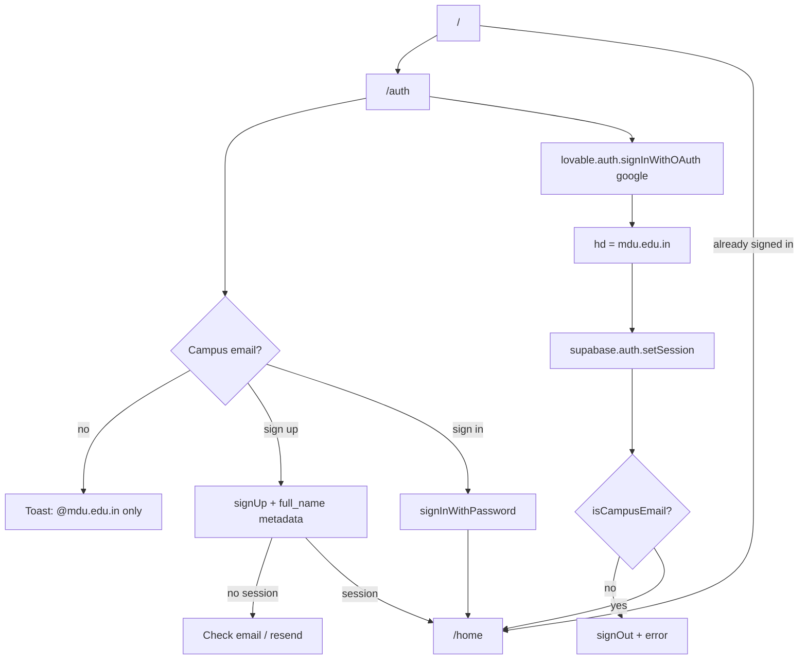
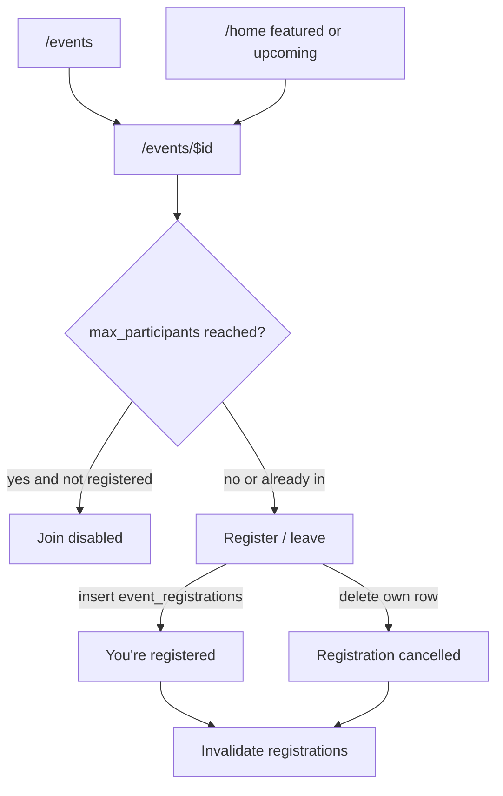
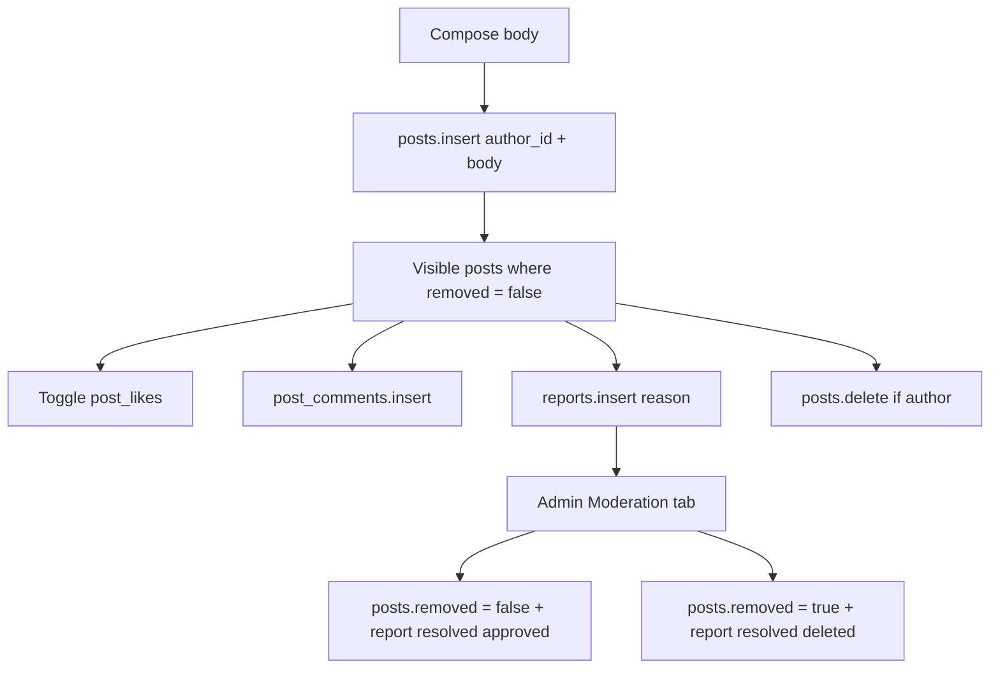
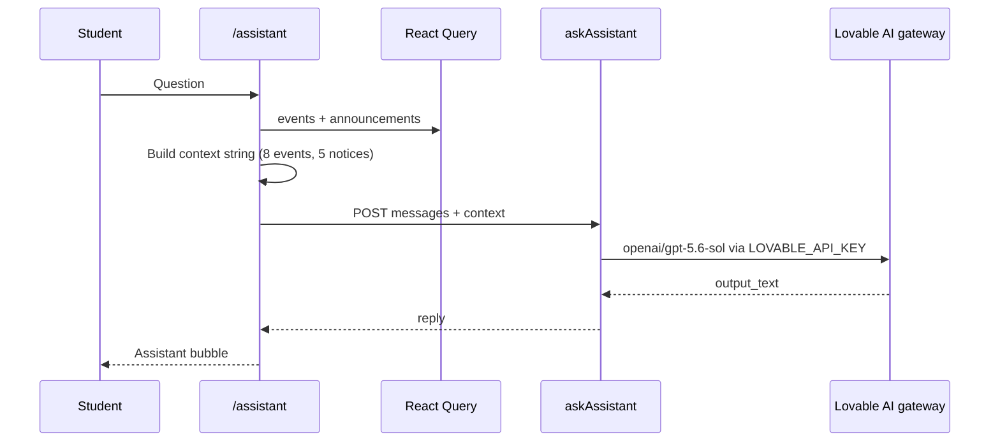

# User flows

These are the product paths as implemented in route components.

## Sign in / sign up

Password sign-up stores `full_name` in user metadata. The Postgres trigger `handle_new_user` then creates `profiles` and a `student` row in `user_roles`.

Google uses Lovable Cloud Auth with `hd: CAMPUS_DOMAIN` and `prompt: select_account`. After tokens are applied, the client still verifies `isCampusEmail`.

## Authenticated session

Every `_authenticated` navigation re-checks the user. Non-campus sessions are signed out immediately.

## Event registration

Capacity is computed in the UI (`eventRegs.length >= max_participants`). The unique constraint `(event_id, user_id)` prevents double registration at the DB.

## Community

Removed posts are hidden from the community list. RLS still lets the author or an admin SELECT them.

## Admin workspace

`/admin` is reachable from the sidebar for admins. Non-admins see an “ADMIN ONLY” message (the route itself is not server-blocked beyond membership).

Tabs:

| Tab | Who | Actions |
| --- | --- | --- |
| Dashboard | club_admin, super_admin | `admin_stats` RPC, calendar of events + attendee counts |
| Events | same | Insert event (title, date, location, category, capacity, featured, …); delete event |
| Announcements | same | Insert notice with priority `normal` / `urgent` |
| Moderation | same | Open vs handled reports; approve keep or delete post; required admin note |
| Admin team | **super_admin only** | UI tab is filtered; RLS allows super admins to INSERT roles and DELETE others’ roles |
| My profile | same | Update own `profiles` row; list events they created |

## Campus AI

Chat is **not stored** in Postgres. Context is assembled client-side from already-fetched campus data.

## Profile and sign out

Students edit `full_name`, `student_id`, `department`, `year`, `bio`, and comma-separated `interests`. Sign out calls `supabase.auth.signOut` and navigates to `/auth`.
